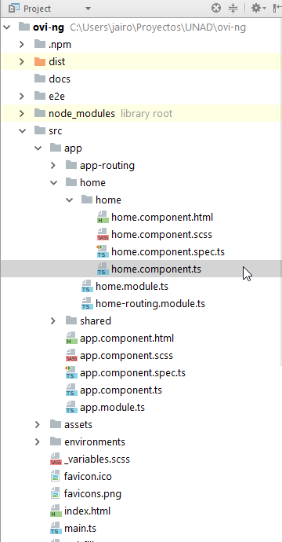
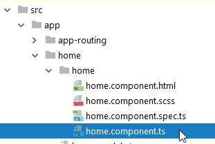
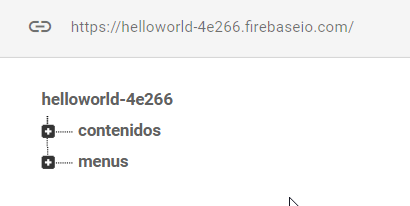
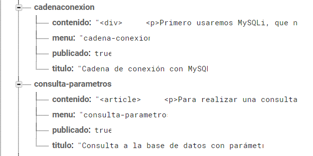
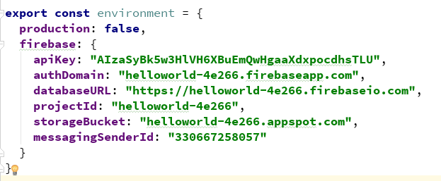
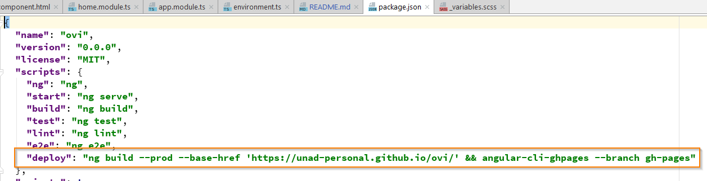

# Ovi
Enlace a GitHub pages
https://unad-personal.github.io/ovi/lecturas

### Estructura

 &nbsp;

### Componente principal
El código del componente que renderiza la página se encuentra en app/home &nbsp;


 &nbsp;

## Estilos
Se pueden encontrar en el archivo _variables.scss y en styles.scss


En el archivo de variables se agregaron los colores corporativos de la Universidad para usarlos en la Sitio


``` 
# variables
$color-exteriores:  #005883;
$amarillo:  #F0B429;
$naranja:  #F47920;
$gris-oscuro: #333333;
$gris-intermedio: #B3B3B3;
$gris-claro: #808080;
$color-fondo: #FFFFFA;
$color-exteriores-contraste: $gris-oscuro;
$tamano-letra: 18px;
```

## Contenidos
Se usó Firebase para poder agregar dinámicamente los contenidos y los menús


 &nbsp;

 &nbsp;

 &nbsp;


## Tutorial de creación del menu
http://www.falconmasters.com/web-design/menu-de-navegacion-responsive/

## Iniciar contenedor docker
```
docker run -ti --rm -v /c/Users/jairo/Proyectos/UNAD/ovi-ng/:/usr/src/app -p 4200:4200 -p 49153:49153 -p 9876:9876 -p 49152:49152 frontened_client-angular
```

## deploy
El comando deploy se personalizó para que genere la carpeta dist y la envie al branch gh-pages y lo suba automáticamente
```sh
npm run deploy
```
 &nbsp;


La imágen usada para el desarrollo se puede consultar en 
https://github.com/jairoFg12-codefull/docker-images

